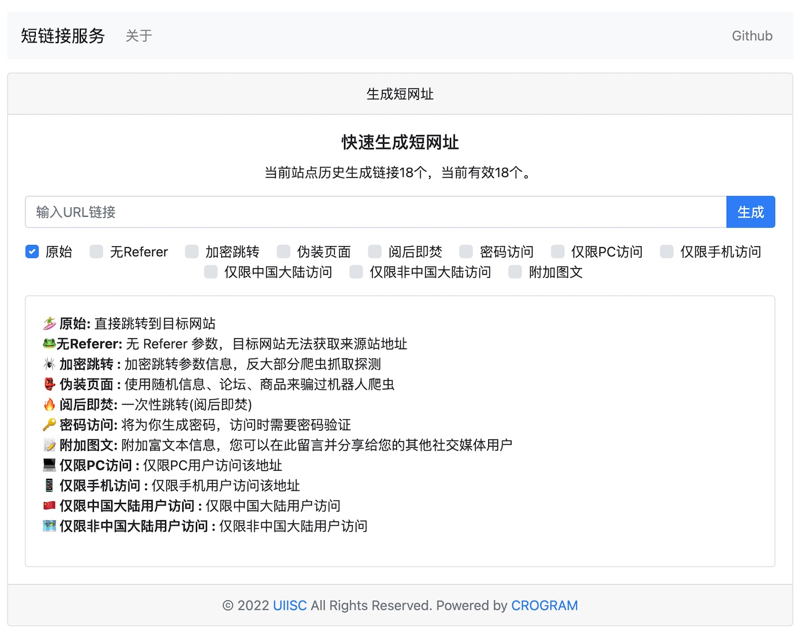

# php-app-shorturl

## 🔗 PHP 轻量级短链接系统

本程序是一款简单的短链接生成系统，极其方便部署。

#### 体验预览

[php-app-shorturl.uiisc.com](http://php-app-shorturl.uiisc.com)



### 支持功能

- 🌵API快速生成短链接
- 🌱在线网页生成短链接
- 🍄支持Redis、File缓存控制（开发中）
- 🏄🏼‍♀️ 原始: 直接跳转到目标网站
- 🐸无Referer: 无 Referer 参数，目标网站无法获取来源站地址
- 🕷 加密跳转 : 加密跳转参数信息，反大部分爬虫抓取探测
- 👺 伪装页面 : 使用随机信息、论坛、商品来骗过机器人爬虫
- 🔥 阅后即焚: 一次性跳转(阅后即焚)
- 🔑 密码访问: 将为你生成密码，访问时需要密码验证
- 📝 附加图文: 附加富文本信息，您可以在此留言并分享给您的其他社交媒体用户
- 💻 仅限PC访问
- 📱 仅限手机访问
- 🇨🇳 仅限中国大陆用户访问
- 🗺️ 仅限非中国大陆用户访问


#### 安装

##### 下载本程序到网站根目录

```bash
php -S 127.0.0.1:12138
```

##### 访问浏览

http://127.0.0.1:12138

##### Nginx 配置

```nginx
location / {
    try_files $uri $uri/ /index.php?$query_string;
}
```

##### Apache 配置

```apl
RewriteEngine on
RewriteBase /
RewriteCond %{REQUEST_FILENAME} !-f
RewriteCond %{REQUEST_FILENAME} !-d
RewriteRule ^(.*)$ /index.php/?$1 [L]
```


##### 二级目录配置

比如，`/shorturl/`以 `/` 结尾，实际访问 `http://ip/shorturl/`

```php
define('SUB_PATH', '/shorturl/');
```

同样，这里 Nginx 要做配置

```nginx
 location /shorturl {
    try_files $uri $uri/ /shorturl/index.php?$query_string;
 }
```

这里 Apache 要做配置

```apl
RewriteRule ^(.*)$ /shorturl/index.php/?$1 [L]
```

#### API

##### 生成短链接

```bash
curl -s http://127.0.0.1:12138/api/link?url=https://uinote.com/article-430.html
```

Response

```json
{"msg":"ok","code":200,"data":"http://127.0.0.1:12138/s/aFdlm"}
```

this project's initial version is forked from https://github.com/ellermister/shorturl, thanks to [ellermister](https://github.com/ellermister) !


